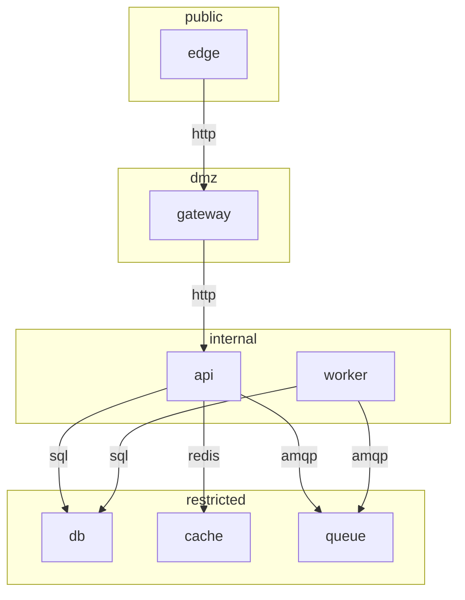

# ananke-demo

<!-- Generated by ananke from src/infra.zig. Do not edit. -->

7 services, 7 permitted connections. Every entry below was checked by the compiler before this file was written.

## Services

| service | tier | image | ports | replicas |
| --- | --- | --- | --- | --- |
| `edge` | public | `nginx:1.27-alpine` | `https` 443/https (public) | 1 |
| `gateway` | dmz | *built here* | `http` 8080/http (cluster) `metrics` 9100/http (host) | 1 |
| `api` | internal | *built here* | `http` 8081/http (cluster) | 3 |
| `worker` | internal | *built here* | - | 2 |
| `db` | restricted | `postgres:16-alpine` | `sql` 5432/postgres (cluster) | 1 |
| `cache` | restricted | `redis:7-alpine` | `redis` 6379/redis (cluster) | 1 |
| `queue` | restricted | `rabbitmq:3-alpine` | `amqp` 5672/amqp (cluster) | 1 |

## Permitted connections

| from | to | port | why |
| --- | --- | --- | --- |
| `edge` | `gateway` | `http` | everything the public sees |
| `gateway` | `api` | `http` | authenticated requests |
| `api` | `db` | `sql` | - |
| `api` | `cache` | `redis` | - |
| `api` | `queue` | `amqp` | enqueues background jobs |
| `worker` | `db` | `sql` | - |
| `worker` | `queue` | `amqp` | consumes background jobs |

## Diagram

